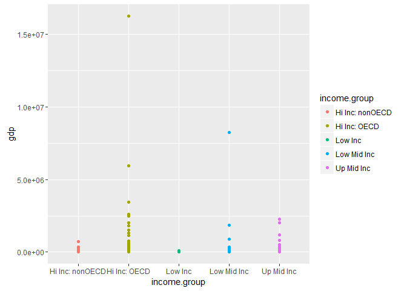
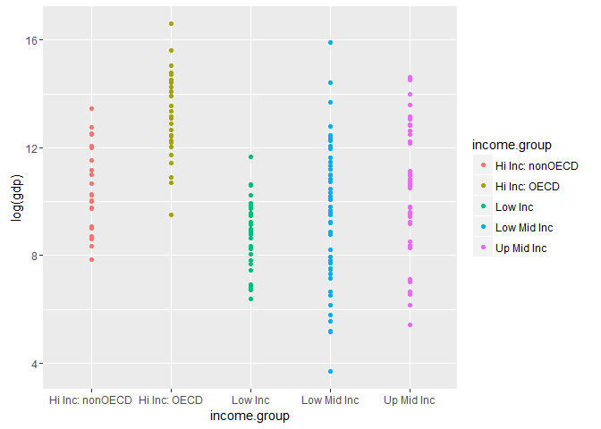
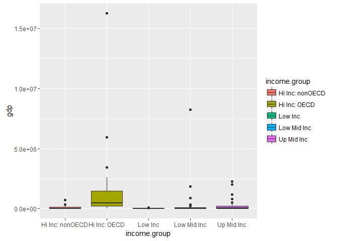
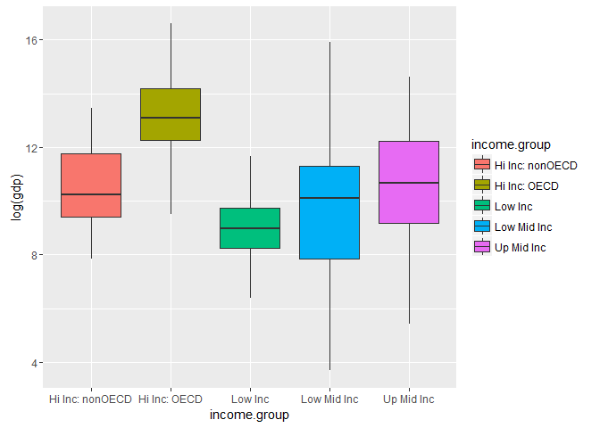

# Case Study 01
Mike Martos  
June 16, 2016  


```r
knitr::opts_chunk$set(echo = TRUE)
```


```r
library(downloader)
library(dplyr)
library(tidyr)
library(stringr)
library(ggplot2)
```

##Introduction

###The GDP is probably the most used metric to describe the economic performance of a country, it shows the monetary measure of all the goods and services produced in a country or region. We intend to describe the economic performance of the countries based on the GDP rankings and Educational stats.


###We are using the information provided by the World Bank, the Gross Domestic Product or GDP and the Education Statistics data, was last updated in April and May of 2016 respectively. We will be comparing the GDP to the education statistics.


###We will be using R and R Studio to calculate and graph basic statistics, both are Open Source statistical tools, with a very active community of users, we will follow a reproducible methodology.

###Download Raw files and load variables

```r
#Download Raw files
download("https://d396qusza40orc.cloudfront.net/getdata%2Fdata%2FGDP.csv",destfile="./Data/Raw/gdp.csv")
download("https://d396qusza40orc.cloudfront.net/getdata%2Fdata%2FEDSTATS_Country.csv",destfile="./Data/Raw/edstats_country.csv")

#load csv to variables
rawGdp <- read.csv("./Data/Raw/gdp.csv")#, sep = ",", skip = 5, header = FALSE, )
rawEdstats <- read.csv("./Data/Raw/edstats_country.csv")#, sep = ",", skip = 5, header = FALSE, )
```

##Clean Data
###A set of commands that will show and summarize the information that will help clean the data.


```r
#Remove empty raws at the top and the bottom, and pull columns with data
gdp <- rawGdp[5:235,c(1,2,4,5)]
#assign column names
names(gdp) <- c("CountryCode","ranking","country","gdp")

#remove empty rows by counting number of characters in CountryCode
gdp <- subset(gdp, nchar(as.character(CountryCode)) > 0)
```

###Check if duplicate country codes, countries and rankings

```r
table(gdp$CountryCode)[table(gdp$CountryCode)>1]
```

```
## named integer(0)
```

```r
table(gdp$country)[table(gdp$country)>1]
```

```
## named integer(0)
```

```r
table(gdp$ranking)[table(gdp$ranking)>1]
```

```
## 
##     178 
##  38   2
```

###From the previous commands, we find that there are two countries with the same ranking 178, St. Kitts and Nevis and Grenada

```r
gdp[gdp$ranking == 178,]
```

```
##     CountryCode ranking             country   gdp
## 182         GRD     178             Grenada  767 
## 183         KNA     178 St. Kitts and Nevis  767
```
###Remove row for world

```r
edstats <- subset(rawEdstats[,c(1:28)], CountryCode != 'WLD')
```

###Check if duplicate country codes

```r
table(edstats$CountryCode)[table(edstats$CountryCode)>1]
```

```
## named integer(0)
```

```r
table(edstats$country)[table(edstats$country)>1]
```

```
## integer(0)
```

###merge gdp and edstats into one dataframe 

```r
#We get 223 matching records
gdpEdstats <- merge(gdp, edstats, by = "CountryCode")
matchingRecords <- dim(gdpEdstats)[1]

#Do we have duplicate rows
gdpEdstats[duplicated(gdpEdstats[,1:31]),]
```

```
##  [1] CountryCode                                      
##  [2] ranking                                          
##  [3] country                                          
##  [4] gdp                                              
##  [5] Long.Name                                        
##  [6] Income.Group                                     
##  [7] Region                                           
##  [8] Lending.category                                 
##  [9] Other.groups                                     
## [10] Currency.Unit                                    
## [11] Latest.population.census                         
## [12] Latest.household.survey                          
## [13] Special.Notes                                    
## [14] National.accounts.base.year                      
## [15] National.accounts.reference.year                 
## [16] System.of.National.Accounts                      
## [17] SNA.price.valuation                              
## [18] Alternative.conversion.factor                    
## [19] PPP.survey.year                                  
## [20] Balance.of.Payments.Manual.in.use                
## [21] External.debt.Reporting.status                   
## [22] System.of.trade                                  
## [23] Government.Accounting.concept                    
## [24] IMF.data.dissemination.standard                  
## [25] Source.of.most.recent.Income.and.expenditure.data
## [26] Vital.registration.complete                      
## [27] Latest.agricultural.census                       
## [28] Latest.industrial.data                           
## [29] Latest.trade.data                                
## [30] Latest.water.withdrawal.data                     
## [31] X2.alpha.code                                    
## <0 rows> (or 0-length row.names)
```

```r
#Recode columns
gdpEdstats$Latest.population.census[gdpEdstats$Latest.population.census == "2006 (rolling)"] <- "2006"

#Count number on NAs, Code generated with Excel
sum(is.na(gdpEdstats$CountryCode))
```

```
## [1] 0
```

```r
sum(is.na(gdpEdstats$country))
```

```
## [1] 0
```

```r
sum(is.na(gdpEdstats$ranking))
```

```
## [1] 0
```

```r
sum(is.na(gdpEdstats$gdp))
```

```
## [1] 0
```

```r
sum(is.na(gdpEdstats$Long.Name))
```

```
## [1] 0
```

```r
sum(is.na(gdpEdstats$Income.Group))
```

```
## [1] 0
```

```r
sum(is.na(gdpEdstats$Region))
```

```
## [1] 0
```

```r
sum(is.na(gdpEdstats$Lending.category))
```

```
## [1] 0
```

```r
sum(is.na(gdpEdstats$Other.groups))
```

```
## [1] 0
```

```r
sum(is.na(gdpEdstats$Currency.Unit))
```

```
## [1] 0
```

```r
sum(is.na(gdpEdstats$Latest.population.census))
```

```
## [1] 0
```

```r
sum(is.na(gdpEdstats$Latest.household.survey))
```

```
## [1] 0
```

```r
sum(is.na(gdpEdstats$Special.Notes))
```

```
## [1] 0
```

```r
sum(is.na(gdpEdstats$National.accounts.base.year))
```

```
## [1] 0
```

```r
sum(is.na(gdpEdstats$National.accounts.reference.year))
```

```
## [1] 186
```

```r
sum(is.na(gdpEdstats$System.of.National.Accounts))
```

```
## [1] 138
```

```r
sum(is.na(gdpEdstats$SNA.price.valuation))
```

```
## [1] 0
```

```r
sum(is.na(gdpEdstats$Alternative.conversion.factor))
```

```
## [1] 0
```

```r
sum(is.na(gdpEdstats$PPP.survey.year))
```

```
## [1] 78
```

```r
sum(is.na(gdpEdstats$Balance.of.Payments.Manual.in.use))
```

```
## [1] 0
```

```r
sum(is.na(gdpEdstats$External.debt.Reporting.status))
```

```
## [1] 0
```

```r
sum(is.na(gdpEdstats$System.of.trade))
```

```
## [1] 0
```

```r
sum(is.na(gdpEdstats$Government.Accounting.concept))
```

```
## [1] 0
```

```r
sum(is.na(gdpEdstats$IMF.data.dissemination.standard))
```

```
## [1] 0
```

```r
sum(is.na(gdpEdstats$Source.of.most.recent.Income.and.expenditure.data))
```

```
## [1] 0
```

```r
sum(is.na(gdpEdstats$Vital.registration.complete))
```

```
## [1] 0
```

```r
sum(is.na(gdpEdstats$Latest.agricultural.census))
```

```
## [1] 0
```

```r
sum(is.na(gdpEdstats$Latest.industrial.data))
```

```
## [1] 128
```

```r
sum(is.na(gdpEdstats$Latest.trade.data))
```

```
## [1] 35
```

```r
sum(is.na(gdpEdstats$Latest.water.withdrawal.data))
```

```
## [1] 71
```

```r
sum(is.na(gdpEdstats$X2.alpha.code))
```

```
## [1] 1
```

```r
#Make numbers look like numbers
gdpEdstats$gdp <- str_replace_all(gdpEdstats$gdp, "[[:punct:]]", "")
gdpEdstats$ranking <- str_replace_all(gdpEdstats$ranking, "[[:punct:]]", "")

#change long name data type
gdpEdstats$Long.Name <- as.character(gdpEdstats$Long.Name)

#Remove NAs, Code generated with Excel
gdpEdstats$CountryCode[is.na(gdpEdstats$CountryCode)] <- ""
gdpEdstats$country[is.na(gdpEdstats$country)] <- ""
gdpEdstats$gdp[is.na(gdpEdstats$gdp)] <- ""
gdpEdstats$ranking[is.na(gdpEdstats$ranking)] <- ""
gdpEdstats$Long.Name[is.na(gdpEdstats$Long.Name)] <- ""
gdpEdstats$Income.Group[is.na(gdpEdstats$Income.Group)] <- ""
gdpEdstats$Region[is.na(gdpEdstats$Region)] <- ""
gdpEdstats$Lending.category[is.na(gdpEdstats$Lending.category)] <- ""
gdpEdstats$Other.groups[is.na(gdpEdstats$Other.groups)] <- ""
gdpEdstats$Currency.Unit[is.na(gdpEdstats$Currency.Unit)] <- ""
gdpEdstats$Latest.population.census[is.na(gdpEdstats$Latest.population.census)] <- ""
gdpEdstats$Latest.household.survey[is.na(gdpEdstats$Latest.household.survey)] <- ""
gdpEdstats$Special.Notes[is.na(gdpEdstats$Special.Notes)] <- ""
gdpEdstats$National.accounts.base.year[is.na(gdpEdstats$National.accounts.base.year)] <- ""
gdpEdstats$National.accounts.reference.year[is.na(gdpEdstats$National.accounts.reference.year)] <- ""
gdpEdstats$System.of.National.Accounts[is.na(gdpEdstats$System.of.National.Accounts)] <- ""
gdpEdstats$SNA.price.valuation[is.na(gdpEdstats$SNA.price.valuation)] <- ""
gdpEdstats$Alternative.conversion.factor[is.na(gdpEdstats$Alternative.conversion.factor)] <- ""
gdpEdstats$PPP.survey.year[is.na(gdpEdstats$PPP.survey.year)] <- ""
gdpEdstats$Balance.of.Payments.Manual.in.use[is.na(gdpEdstats$Balance.of.Payments.Manual.in.use)] <- ""
gdpEdstats$External.debt.Reporting.status[is.na(gdpEdstats$External.debt.Reporting.status)] <- ""
gdpEdstats$System.of.trade[is.na(gdpEdstats$System.of.trade)] <- ""
gdpEdstats$Government.Accounting.concept[is.na(gdpEdstats$Government.Accounting.concept)] <- ""
gdpEdstats$IMF.data.dissemination.standard[is.na(gdpEdstats$IMF.data.dissemination.standard)] <- ""
gdpEdstats$Source.of.most.recent.Income.and.expenditure.data[is.na(gdpEdstats$Source.of.most.recent.Income.and.expenditure.data)] <- ""
gdpEdstats$Vital.registration.complete[is.na(gdpEdstats$Vital.registration.complete)] <- ""
gdpEdstats$Latest.agricultural.census[is.na(gdpEdstats$Latest.agricultural.census)] <- ""
gdpEdstats$Latest.industrial.data[is.na(gdpEdstats$Latest.industrial.data)] <- ""
gdpEdstats$Latest.trade.data[is.na(gdpEdstats$Latest.trade.data)] <- ""
gdpEdstats$Latest.water.withdrawal.data[is.na(gdpEdstats$Latest.water.withdrawal.data)] <- ""
gdpEdstats$X2.alpha.code[is.na(gdpEdstats$X2.alpha.code)] <- ""

#change type of column
gdpEdstats$gdp <- as.numeric(gdpEdstats$gdp)
gdpEdstats$gdp[is.na(gdpEdstats$gdp)] <- 0
gdpEdstats$ranking <- as.numeric(gdpEdstats$ranking)
gdpEdstats$ranking[is.na(gdpEdstats$ranking)] <- 0
gdpEdstats$CountryCode <- as.character(gdpEdstats$CountryCode)
gdpEdstats$country <- as.character(gdpEdstats$country)
gdpEdstats$Long.Name <- as.character(gdpEdstats$Long.Name)

# Deal with Aggregate regions, create a csv file just in case and remove from working data frame
write.csv(gdpEdstats[grep(".aggregate.", gdpEdstats$Special.Notes)[-5],], file ="./Data/AggregateRegions.csv")
gdpEdstatsCl <- gdpEdstats[-grep(".aggregate.", gdpEdstats$Special.Notes)[-5],]
#Remove countries with no GDP
gdpEdstatsCl <- gdpEdstatsCl[gdpEdstatsCl$gdp > 0,]

#change column names, Code generated with Excel
names(gdpEdstatsCl)[1] <- "country.code"
names(gdpEdstatsCl)[5] <- "long.name"
names(gdpEdstatsCl)[6] <- "income.group"
names(gdpEdstatsCl)[7] <- "region"
names(gdpEdstatsCl)[8] <- "lending.category"
names(gdpEdstatsCl)[9] <- "other.groups"
names(gdpEdstatsCl)[10] <- "currency.unit"
names(gdpEdstatsCl)[11] <- "latest.population.census"
names(gdpEdstatsCl)[12] <- "latest.household.survey"
names(gdpEdstatsCl)[13] <- "special.notes"
names(gdpEdstatsCl)[14] <- "national.accounts.base.year"
names(gdpEdstatsCl)[15] <- "national.accounts.reference.year"
names(gdpEdstatsCl)[16] <- "system.of.national.accounts"
names(gdpEdstatsCl)[17] <- "sna.price.valuation"
names(gdpEdstatsCl)[18] <- "alternative.conversion.factor"
names(gdpEdstatsCl)[19] <- "ppp.survey.year"
names(gdpEdstatsCl)[20] <- "balance.of.payments.manual.in.use"
names(gdpEdstatsCl)[21] <- "external.debt.reporting.status"
names(gdpEdstatsCl)[22] <- "system.of.trade"
names(gdpEdstatsCl)[23] <- "government.accounting.concept"
names(gdpEdstatsCl)[24] <- "imf.data.dissemination.standard"
names(gdpEdstatsCl)[25] <- "source.of.most.recent.income.and.expenditure.data"
names(gdpEdstatsCl)[26] <- "vital.registration.complete"
names(gdpEdstatsCl)[27] <- "latest.agricultural.census"
names(gdpEdstatsCl)[28] <- "latest.industrial.data"
names(gdpEdstatsCl)[29] <- "latest.trade.data"
names(gdpEdstatsCl)[30] <- "latest.water.withdrawal.data"
names(gdpEdstatsCl)[31] <- "country.2.code"

# Save intermediate csv after cleaning
write.csv(gdpEdstatsCl, file ="./Data/Merged01.csv")

#Count each column or show an extract for the columns, Code generated with Excel
summary(gdpEdstatsCl$country.code)
```

```
##    Length     Class      Mode 
##       189 character character
```

```r
summary(gdpEdstatsCl$country)
```

```
##    Length     Class      Mode 
##       189 character character
```

```r
summary(gdpEdstatsCl$gdp)
```

```
##     Min.  1st Qu.   Median     Mean  3rd Qu.     Max. 
##       40     6972    28240   379600   205800 16240000
```

```r
summary(gdpEdstatsCl$long.name)
```

```
##    Length     Class      Mode 
##       189 character character
```

```r
summary(gdpEdstatsCl$income.group)
```

```
##                      High income: nonOECD    High income: OECD 
##                    0                   23                   30 
##           Low income  Lower middle income  Upper middle income 
##                   37                   54                   45
```

```r
summary(gdpEdstatsCl$region)
```

```
##                                   East Asia & Pacific 
##                          0                         29 
##      Europe & Central Asia  Latin America & Caribbean 
##                         50                         35 
## Middle East & North Africa              North America 
##                         18                          3 
##                 South Asia         Sub-Saharan Africa 
##                          8                         46
```

```r
summary(gdpEdstatsCl$lending.category)
```

```
##       Blend  IBRD   IDA 
##    51    16    62    60
```

```r
summary(gdpEdstatsCl$other.groups)
```

```
##           Euro area      HIPC 
##       134        16        39
```

```r
head(gdpEdstatsCl$currency.unit,10)
```

```
##  [1] Aruban florin         Afghan afghani        Angolan kwanza       
##  [4] Albanian lek          U.A.E. dirham         Argentine peso       
##  [7] Armenian dram         East Caribbean dollar Australian dollar    
## [10] Euro                 
## 155 Levels:  Afghan afghani Albanian lek Algerian dinar ... Zimbabwe dollar
```

```r
summary(gdpEdstatsCl$latest.population.census)
```

```
##                          1970           1979           1981           1983 
##              1              2              1              2              0 
##           1984           1987           1989           1990           1991 
##              2              1              1              1              1 
##           1993           1995           1996           1997           1998 
##              2              1              2              1              3 
##           1999           2000           2001           2002           2003 
##              5             30             45             21              7 
##           2004           2005           2006 2006 (rolling)           2007 
##             12             12             15              0              7 
##           2008           2009 Register based 
##              7              5              2
```

```r
head(gdpEdstatsCl$latest.household.survey)
```

```
## [1]                          MICS, 2003              
## [3] MICS, 2001, MIS, 2006/07 MICS, 2005              
## [5]                                                  
## 56 Levels:  CPS (monthly) Demographic survey, 2007 DGHS, 2003 ... RHS, 2008
```

```r
str(gdpEdstatsCl$national.accounts.base.year)
```

```
##  Factor w/ 44 levels "","1954","1973",..: 25 38 28 1 25 22 1 18 1 33 ...
```

```r
summary(gdpEdstatsCl$national.accounts.reference.year)
```

```
##    Length     Class      Mode 
##       189 character character
```

```r
summary(gdpEdstatsCl$system.of.national.accounts)
```

```
##    Length     Class      Mode 
##       189 character character
```

```r
summary(gdpEdstatsCl$sna.price.valuation)
```

```
##     VAB VAP 
##   4 150  35
```

```r
summary(gdpEdstatsCl$alternative.conversion.factor)
```

```
##                           1960-85          1965-84          1965-95 
##              144                1                1                1 
##          1970-08          1971-84          1971-98          1973-87 
##                1                1                1                1 
##          1977-90 1978-89, 1991-92          1978-93          1980-02 
##                0                1                1                1 
##          1985-90             1986    1987-89, 1992          1987-95 
##                1                0                1                5 
## 1987-95, 1997-07          1988-89             1989          1990-92 
##                1                1                1                1 
##          1990-95          1990-96             1991          1991-96 
##                8                1                2                1 
##       1991, 1998             1992          1992-93          1992-94 
##                1                1                1                1 
##          1992-95             1993             1994       1997, 2004 
##                2                3                1                1 
##          1999-01 
##                1
```

```r
summary(gdpEdstatsCl$ppp.survey.year)
```

```
##    Length     Class      Mode 
##       189 character character
```

```r
summary(gdpEdstatsCl$balance.of.payments.manual.in.use)
```

```
##      BPM4 BPM5 
##   22    9  158
```

```r
summary(gdpEdstatsCl$external.debt.reporting.status)
```

```
##                  Actual    Estimate Preliminary 
##          64          92          11          22
```

```r
summary(gdpEdstatsCl$system.of.trade)
```

```
##         General Special 
##      16     104      69
```

```r
summary(gdpEdstatsCl$government.accounting.concept)
```

```
##                 Budgetary Consolidated 
##           45           35          109
```

```r
summary(gdpEdstatsCl$imf.data.dissemination.standard)
```

```
##      GDDS SDDS 
##   29   92   68
```

```r
summary(gdpEdstatsCl$source.of.most.recent.income.and.expenditure.data)
```

```
##                  1-2-3, 2005-06       CWIQ 2007      CWIQ, 2002 
##              49               1               1               1 
##      CWIQ, 2003      CWIQ, 2006 CWIQ/ IHS, 2005  CWIQ/ PS, 2005 
##               2               2               1               1 
##     CWIQ/, 2003      ES/BS 1995      ES/BS 2007  ES/BS, 1993/94 
##               1               1               2               2 
##     ES/BS, 1994  ES/BS, 1994/95     ES/BS, 1998     ES/BS, 1999 
##               1               1               1               1 
##     ES/BS, 2000  ES/BS, 2000/01     ES/BS, 2001     ES/BS, 2002 
##               3               2               2               1 
##  ES/BS, 2002-03  ES/BS, 2002/03     ES/BS, 2003     ES/BS, 2004 
##               2               1               2               5 
##  ES/BS, 2004-05     ES/BS, 2005     ES/BS, 2006     ES/BS, 2007 
##               1               6               3               4 
##     ES/BS, 2008       IHS, 1992       IHS, 1995       IHS, 1996 
##               1               1               2               1 
##       IHS, 1998       IHS, 1999       IHS, 2000       IHS, 2001 
##               1               1               9               1 
##       IHS, 2002       IHS, 2003    IHS, 2003-04       IHS, 2004 
##               1               4               1               2 
##    IHS, 2004-05    IHS, 2004/05       IHS, 2005    IHS, 2005-06 
##               1               1               3               1 
##       IHS, 2006       IHS, 2007         IS 1996         IS 2000 
##               6              10               1               1 
##        IS, 1993        IS, 1996        IS, 1997        IS, 1999 
##               1               1               2               1 
##        IS, 2000        ITR 1997        LFS 2000       LFS, 2000 
##               3               1               1               1 
##       LFS, 2005       LFS, 2006       LFS, 2007       LFS, 2008 
##               1               2               3               1 
##      LSMS, 1998   LSMS, 2003/04      LSMS, 2004   LSMS, 2004-05 
##               1               1               2               1 
##   LSMS, 2004/05      LSMS, 2005      LSMS, 2006   LSMS, 2006-08 
##               1               2               2               1 
##      LSMS, 2007      PS 2000-01         PS 2005        PS, 2001 
##               3               1               2               1 
##        PS, 2002     PS, 2002-03        PS, 2003        PS, 2005 
##               0               1               1               1 
##    QWIC/PS 2005 
##               1
```

```r
summary(gdpEdstatsCl$vital.registration.complete)
```

```
##     Yes 
##  98  91
```

```r
summary(gdpEdstatsCl$latest.agricultural.census)
```

```
##                                                          1960 
##                             58                              2 
##                        1964-65                           1970 
##                              1                              1 
##                        1970-71                           1971 
##                              1                              2 
##                           1973                        1974-75 
##                              1                              1 
##                      1977-1979                      1978-1979 
##                              1                              1 
##                           1980                           1981 
##                              1                              3 
##                           1984                      1984-1985 
##                              4                              2 
##                      1984-1988                           1985 
##                              1                              1 
##                      1985-1986                           1988 
##                              1                              1 
##                           1990                           1991 
##                              2                              3 
##                           1992                           1993 
##                              1                              4 
##                           1994                        1994-95 
##                              4                              1 
##            1995-1996/2000-2001                           1996 
##                              1                              4 
##                      1996-1997                      1996/2001 
##                              1                              1 
##                      1996/2002                           1997 
##                              1                              4 
##                      1997/2002                           1998 
##                              2                              3 
##                      1998-1999                           1999 
##                              3                              5 
##                      1999-2000 1999-2000 (conducted annually) 
##                             11                              4 
##                           2000                      2000-2001 
##                             12                              2 
##                           2001                      2001-2002 
##                             13                              2 
##                           2002                      2002-2003 
##                              8                              1 
##                           2003                           2004 
##                              7                              5 
##                           2005 
##                              1
```

```r
summary(gdpEdstatsCl$latest.industrial.data)
```

```
##    Length     Class      Mode 
##       189 character character
```

```r
summary(gdpEdstatsCl$latest.trade.data)
```

```
##    Length     Class      Mode 
##       189 character character
```

```r
summary(gdpEdstatsCl$latest.water.withdrawal.data)
```

```
##    Length     Class      Mode 
##       189 character character
```

```r
head(gdpEdstatsCl$country.2.code, 20)
```

```
##  [1] AW AF AO AL AE AR AM AG AU AT AZ BI BE BJ BF BD BG BH BS BA
## 208 Levels:  AD AE AF AG AL AM AO AR AS AT AU AW AZ BA BB BD BE BF ... ZW
```
#Answer to Questions
#Question 1 : Match the data based on the country shortcode. How many of the IDs match
###The merging of the files was done earlier in the code, right after the cleaning of each individual variable (gdp, edstats), I have to note that the answer could be different, as it depends on when that merging occurs, if I remove the regional records befor the merging for example.

```r
#Match the data based on the country shortcode. How many of the IDs match
matchingRecords
```

```
## [1] 223
```

#Question 2	: Sort the data frame in ascending order by GDP (so United States is last). What is the 13th country in the resulting data frame?
###The question is answered by running the *order* function, and the answer is **St. Kitts and Nevis**


```r
#Sort data frame in ascending order by GDP and Country.
gdpEdstatsClSorted <- gdpEdstatsCl[order(gdpEdstatsCl$gdp, gdpEdstatsCl$country),]
gdpEdstatsClSorted[13,3]
```

```
## [1] "St. Kitts and Nevis"
```

#Question 3	: What are the average GDP rankings for the *High income: OECD* and *High income: nonOECD* groups?  
###I broke the question in four answers, two for the Rankings and to for the actual GDP values, in addition, I'm checking if I still have zeroes, as those were introduced when dealing with missing values, and converting the variable to a number, but the zeroes are not real values and have to be removed from the mean calculation as that would affect the mean, as it is not resistant to outliers.

##High income: OECD
###This is the mean of GDP

```r
hiOECD <- subset(gdpEdstatsClSorted$gdp, gdpEdstatsClSorted$income.group == "High income: OECD")
#Do I have zeroes?
sum(hiOECD == 0)
```

```
## [1] 0
```

```r
#Calculate Mean
mean(hiOECD)
```

```
## [1] 1483917
```
###This is the mean of the rankings

```r
hiOECD <- subset(gdpEdstatsClSorted$ranking, gdpEdstatsClSorted$income.group == "High income: OECD")
#Do I have zeroes?
sum(hiOECD == 0)
```

```
## [1] 0
```

```r
#Calculate Mean
mean(hiOECD)
```

```
## [1] 32.96667
```

##High income: nonOECD
###This is the mean of GDP

```r
#Question 3.b High income: nonOECD
hiNoOECD <- subset(gdpEdstatsClSorted$gdp, gdpEdstatsClSorted$income.group == "High income: nonOECD")
#Do I have zeroes?
sum(hiNoOECD == 0)
```

```
## [1] 0
```

```r
#Calculate Mean
mean(hiNoOECD)
```

```
## [1] 104349.8
```
###This is the mean of the rankings

```r
#Question 3.b High income: nonOECD
hiNoOECD <- subset(gdpEdstatsClSorted$ranking, gdpEdstatsClSorted$income.group == "High income: nonOECD")
#Do I have zeroes?
sum(hiNoOECD == 0)
```

```
## [1] 0
```

```r
#Calculate Mean
mean(hiNoOECD)
```

```
## [1] 91.91304
```

#Question 4 Plot the GDP for all of the countries. Use ggplot2 to color your plot by Income Group
###I tried a couple of plots and a log transformation on both, there are outliers in every group, the data is right skewed as well, and the spread of the groups is so different, that seems that the log transformation is the recommended one.


```r
#Scatter plot with raw gdp
bp1 <- ggplot(gdpEdstatsCl, aes(x=income.group, y=gdp, col=income.group))
bp1 + geom_point()
```

<!-- -->

```r
#Scatter plot with gdp transformed to log scale
bp1 <- ggplot(gdpEdstatsCl, aes(x=income.group, y=log(gdp), col=income.group))
bp1 + geom_point()
```

<!-- -->

```r
#Boxplot with raw gdp
bp <- ggplot(gdpEdstatsCl, aes(x=income.group, y=gdp, fill=income.group))
bp + geom_boxplot() 
```

<!-- -->

```r
#Boxplot with gdp transformed to log scale
bp <- ggplot(gdpEdstatsCl, aes(x=income.group, y=log(gdp), fill=income.group))
bp + geom_boxplot() 
```

<!-- -->

#Question 5:	Cut the GDP ranking into 5 separate quantile groups. Make a table versus Income.Group. How many countries are Lower middle income but among the 38 nations with highest GDP?
###There are 16 countries that are in the Lower Middle Income group but are part of the highest GDP group.


```r
#Quantile breaks
quantiles <- quantile(gdpEdstatsCl$ranking, probs = seq(0, 1, 0.2) )
#Tag rows according to breaks 
gdpEdstatsCl$quantile <- cut(gdpEdstatsCl$ranking, breaks=c(quantiles), labels=c("0-20","20-40","40-60","60-80","80-100"), include.lowest=TRUE)
#Show table with all groups and counts
table(gdpEdstatsCl$income.group,gdpEdstatsCl$quantile)
```

```
##                  
##                   0-20 20-40 40-60 60-80 80-100
##   Hi Inc: nonOECD    4     5     8     4      2
##   Hi Inc: OECD      18    10     1     1      0
##   Low Inc            0     1     9    16     11
##   Low Mid Inc        5    13    11     9     16
##   Up Mid Inc        11     9     8     8      9
```

```r
#Filter by income group
lmi <- gdpEdstatsCl[gdpEdstatsCl$income.group=="Low Mid Inc",]
#Filter by ranking quantile
lmi80_100 <- lmi[lmi$quantile=="80-100",]
#List countries 
lmi80_100[,3]
```

```
##  [1] "Belize"                "Bhutan"               
##  [3] "Cape Verde"            "Micronesia, Fed. Sts."
##  [5] "Guyana"                "Kiribati"             
##  [7] "Lesotho"               "Maldives"             
##  [9] "Marshall Islands"      "São Tomé and Principe"
## [11] "Swaziland"             "Timor-Leste"          
## [13] "Tonga"                 "Tuvalu"               
## [15] "Vanuatu"               "Samoa"
```

```r
# Save csv after cleaning
write.csv(gdpEdstatsCl, file ="./Data/FinalCleaned.csv")
```
